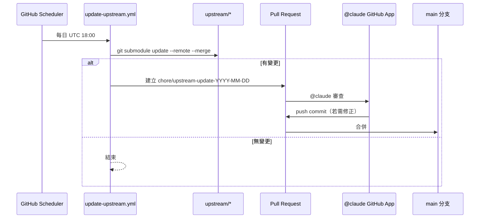

# 架構文件

## 系統概觀

```mermaid
graph TD
    subgraph "Buddha-skills (本 repo)"
        A[.claude/skills/dev-log]
        B[.claude/skills/auto-dev-mode]
        C[docs/DEV_LOG.md]
        D[docs/DEV_LOG_RULES.md]
        E[CLAUDE.md]
    end

    subgraph "upstream/ 唯讀子模組"
        U1[anthropic-skills]
        U2[andrej-karpathy-skills]
        U3[oh-my-claudecode]
    end

    subgraph "CI/CD"
        W1[update-upstream.yml<br/>每日 UTC 18:00]
        W2[claude-review.yml<br/>@claude 觸發]
        W3[upstream-guard.yml<br/>PR 觸發]
    end

    A -->|讀規則| D
    A -->|寫入| C
    E -->|引用| D
    W1 -->|git submodule update| U1
    W1 -->|git submodule update| U2
    W1 -->|git submodule update| U3
    W1 -->|建立 PR| W2
    W2 -->|@claude 審查並 push| W1
    W3 -.->|阻擋直接修改| U1
```

## 同步流程


