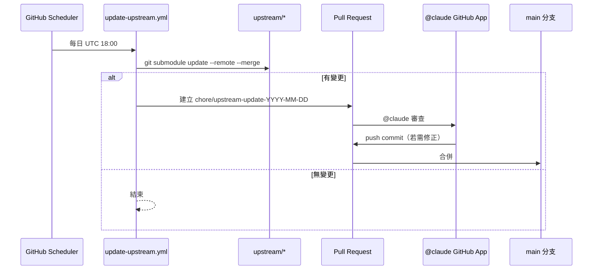

# Buddha-skills 開發工作流 Implementation Plan

> **For agentic workers:** REQUIRED SUB-SKILL: Use superpowers:subagent-driven-development (recommended) or superpowers:executing-plans to implement this plan task-by-task. Steps use checkbox (`- [ ]`) syntax for tracking.

**Goal:** 為使用者專屬 skills 庫 `Buddha-skills` 建立開發日誌 skill、上游子模組鏡像、與每日自動同步+Claude 審查工作流。

**Architecture:** `D:\36_Buddha-skills` 初始化為 git 倉庫，以三個唯讀 `git submodule` 引入上游參考專案到 `upstream/`，GitHub Actions 每日執行 `git submodule update --remote --merge`，產生 PR 並於 body 內 `@claude` 呼叫 GitHub Claude App 自動審查與 push 修正。開發日誌以 `.claude/skills/dev-log/` skill 包裝，搭配 `docs/DEV_LOG_RULES.md` 作為跨 clone 一致性規則。

**Tech Stack:** Git（submodule + gitattributes），GitHub Actions（schedule cron、peter-evans/create-pull-request、anthropics/claude-code-action），Claude Code skills（YAML frontmatter + Markdown），正體中文文件。

**Spec:** `docs/superpowers/specs/2026-04-15-dev-workflow-design.md`

---

## 檔案結構

### 建立的檔案
```
.gitignore
.gitattributes
.gitmodules                                       # git submodule add 自動產生
README.md
CLAUDE.md
MEMORY.md
ROADMAP.md
docs/TEAM_ROLES.md
docs/DEV_LOG.md
docs/DEV_LOG_RULES.md
docs/ARCHITECTURE.md
.claude/skills/dev-log/SKILL.md
.claude/skills/auto-dev-mode/SKILL.md
upstream/README.md
.github/workflows/update-upstream.yml
.github/workflows/claude-review.yml
.github/workflows/upstream-guard.yml
```

### 子模組（submodule add 後自動納入）
```
upstream/anthropic-skills/         → github.com/anthropics/skills main
upstream/andrej-karpathy-skills/   → github.com/forrestchang/andrej-karpathy-skills main
upstream/oh-my-claudecode/         → github.com/yeachan-heo/oh-my-claudecode main
```

### 保留的既有檔案
```
CLAUDE-CODE-自動開發指令.md        # 不動
.omc/                              # 不動
```

---

## Task 1：初始化倉庫與推送 main

**Files:**
- Create: `D:\36_Buddha-skills\.gitignore`
- Create: `D:\36_Buddha-skills\README.md`

- [ ] **Step 1.1: 初始化 git**

Run:
```bash
cd /d/36_Buddha-skills
git init -b main
git config user.name "LostSunset"
git config user.email "lollipopg4ao3@gmail.com"
```
Expected: `Initialized empty Git repository in D:/36_Buddha-skills/.git/`

- [ ] **Step 1.2: 建立 `.gitignore`**

寫入 `D:\36_Buddha-skills\.gitignore`：
```gitignore
# macOS / Windows
.DS_Store
Thumbs.db
desktop.ini

# Editor
.vscode/
.idea/
*.swp
*~

# Claude local state
.claude/settings.local.json
.claude/state/
.claude/cache/

# OMC
.omc/cache/
.omc/logs/

# Logs
*.log

# Node / Python build artifacts
node_modules/
__pycache__/
*.pyc
dist/
build/

# Environment
.env
.env.local
```

- [ ] **Step 1.3: 建立 `README.md`**

寫入 `D:\36_Buddha-skills\README.md`：
````markdown
# Buddha-skills

> LostSunset 專屬的 Claude Code skills 庫。

## 內容

- `.claude/skills/` — 本專案自建 skill（`dev-log`、`auto-dev-mode`）
- `upstream/` — 上游參考子模組（**唯讀鏡像**），每日自動同步
  - `anthropic-skills/` — [anthropics/skills](https://github.com/anthropics/skills)
  - `andrej-karpathy-skills/` — [forrestchang/andrej-karpathy-skills](https://github.com/forrestchang/andrej-karpathy-skills)
  - `oh-my-claudecode/` — [yeachan-heo/oh-my-claudecode](https://github.com/yeachan-heo/oh-my-claudecode)
- `docs/` — 開發日誌、規則、架構文件
- `CLAUDE-CODE-自動開發指令.md` — Claude Code 四種模式（A/B/C/D）自動開發流程

## Clone

```bash
git clone --recurse-submodules https://github.com/LostSunset/Buddha-skills.git
```

若已 clone：
```bash
git submodule update --init --recursive
```

## 開發規範

見 [CLAUDE.md](./CLAUDE.md) 與 [docs/DEV_LOG_RULES.md](./docs/DEV_LOG_RULES.md)。
````

- [ ] **Step 1.4: 接上 remote 並首次 commit**

Run:
```bash
git remote add origin https://github.com/LostSunset/Buddha-skills.git
git add .gitignore README.md CLAUDE-CODE-自動開發指令.md docs/superpowers/
git commit -m "chore: repository initialization

- add .gitignore and README
- include existing CLAUDE-CODE-自動開發指令.md
- include brainstorming spec and plan"
git push -u origin main
```
Expected: push 成功。若遠端已有 commit，先 `git pull --rebase origin main`。

---

## Task 2：建立治理文件

**Files:**
- Create: `D:\36_Buddha-skills\CLAUDE.md`
- Create: `D:\36_Buddha-skills\MEMORY.md`
- Create: `D:\36_Buddha-skills\ROADMAP.md`
- Create: `D:\36_Buddha-skills\docs\TEAM_ROLES.md`
- Create: `D:\36_Buddha-skills\docs\DEV_LOG.md`
- Create: `D:\36_Buddha-skills\docs\DEV_LOG_RULES.md`
- Create: `D:\36_Buddha-skills\docs\ARCHITECTURE.md`

- [ ] **Step 2.1: 建立分支**

Run:
```bash
git checkout -b feature/governance-docs
```

- [ ] **Step 2.2: 建立 `CLAUDE.md`**

寫入 `D:\36_Buddha-skills\CLAUDE.md`：
````markdown
# CLAUDE.md — Buddha-skills 開發規範

> 本檔案為本專案的 Claude Code 指令。任何 clone 此專案的 Claude Code（包含 `@claude` GitHub App）都必須遵循以下規則。

## 專案性質

- LostSunset 專屬的 Claude Code skills 庫
- `upstream/` 下的子模組為**唯讀鏡像**，禁止任何修改
- 文件、commit message、日誌一律使用**正體中文**

## 目錄

- `.claude/skills/` — 本專案 skills
- `upstream/` — 上游參考（唯讀）
- `docs/` — 文件與開發日誌

## 開發流程

依 `CLAUDE-CODE-自動開發指令.md` 的四種模式（A 新專案 / B 開發中 / C 維護 / D 接手）自動偵測並執行。

## 開發日誌

**每次迭代完成前必須更新 `docs/DEV_LOG.md`**，規則見 [`docs/DEV_LOG_RULES.md`](./docs/DEV_LOG_RULES.md)。
使用 `dev-log` skill 自動套用模板。

## 六項必做更新

每次合併 PR 前：
1. Commit & 推送
2. 更新版本與 README
3. 發佈 Release（版本異動時）
4. 更新 CLAUDE.md 與 MEMORY.md
5. 更新 ROADMAP.md
6. 更新 `docs/DEV_LOG.md`

## Commit 規範

```
<type>(scope): <subject>

<body>

Refs: #issue
```

type：`feat` / `fix` / `refactor` / `test` / `docs` / `chore` / `style` / `perf` / `ci`

## 分支策略

- `main` — 穩定版
- `feature/<name>` — 功能開發
- `fix/<name>` — Bug 修復
- `chore/upstream-update-YYYY-MM-DD` — 每日上游同步（自動）

## upstream 子模組

- 追蹤各自的 `main` 分支
- 每日 UTC 18:00 自動同步（workflow `update-upstream.yml`）
- **嚴禁**手動修改 `upstream/<name>/**` 內容，由 `upstream-guard.yml` 於 PR 阻擋

## @claude 權限

- GitHub Claude App 允許直接 push commit 到 PR 分支
- 僅在 `upstream-sync` label 的 PR 或被 @mention 時作動
````

- [ ] **Step 2.3: 建立 `MEMORY.md`**

寫入 `D:\36_Buddha-skills\MEMORY.md`：
````markdown
# 專案記憶檔

## 技術決策記錄

| 日期 | 決策 | 理由 | 影響範圍 |
|------|------|------|----------|
| 2026-04-15 | 上游以 git submodule 追蹤 main | 保持與原作者完全一致、可追溯版本 | `upstream/` |
| 2026-04-15 | 每日 UTC 18:00 自動同步 | 台北凌晨避開工作時段 | CI |
| 2026-04-15 | 文件一律正體中文 | 使用者語言偏好 | 所有文件 |
| 2026-04-15 | @claude 可直接 push 到 PR 分支 | 降低手動介入，加快同步 | workflow 權限 |

## 已知問題與解法

| 問題 | 解法 | 發現日期 |
|------|------|----------|
| `GITHUB_TOKEN` 建立的 PR 不觸發其他 workflow | 改用 fine-grained `PAT_TOKEN` | 2026-04-15 |

## 重要上下文

- 遠端倉庫：https://github.com/LostSunset/Buddha-skills.git
- Claude GitHub App 已安裝於本 repo
- 需於 repo secrets 設定 `ANTHROPIC_API_KEY` 與 `PAT_TOKEN`

## 每次迭代摘要

| 迭代 | 日期 | 完成步驟 | 重點變更 |
|------|------|----------|----------|
| #1 | 2026-04-15 | Task 1 | 倉庫初始化、README、.gitignore |
````

- [ ] **Step 2.4: 建立 `ROADMAP.md`**

寫入 `D:\36_Buddha-skills\ROADMAP.md`：
````markdown
# ROADMAP

## Phase 1：工作流基礎建設（本次實作）

### Step 1：倉庫初始化
- **狀態**: ✅ 完成
- **預估時間**: 0.5 小時
- **依賴**: 無
- **範圍**: `git init`、`.gitignore`、`README.md`、連 remote、首次 push
- **驗收條件（AC）**:
  - [x] `main` 分支已推送
  - [x] 遠端 clone 可見檔案
- **完成日期**: 2026-04-15

### Step 2：治理文件
- **狀態**: 🔨 進行中
- **預估時間**: 0.5 小時
- **依賴**: Step 1
- **範圍**: CLAUDE.md、MEMORY.md、ROADMAP.md、docs/TEAM_ROLES.md、docs/DEV_LOG.md、docs/DEV_LOG_RULES.md、docs/ARCHITECTURE.md
- **驗收條件（AC）**:
  - [ ] 所有治理文件建立且正體中文
  - [ ] PR 合併入 main

### Step 3：dev-log 與 auto-dev-mode skills
- **狀態**: 🔲 未開始
- **預估時間**: 1 小時
- **依賴**: Step 2
- **範圍**: `.claude/skills/dev-log/SKILL.md`、`.claude/skills/auto-dev-mode/SKILL.md`
- **驗收條件（AC）**:
  - [ ] Claude Code 能辨識兩個 skill
  - [ ] `dev-log` skill 以使用者「寫開發日誌」觸發可正確 append

### Step 4：upstream 子模組與防改動 guard
- **狀態**: 🔲 未開始
- **預估時間**: 1 小時
- **依賴**: Step 1
- **範圍**: 三個 submodule、`.gitattributes`、`upstream/README.md`、`upstream-guard.yml`
- **驗收條件（AC）**:
  - [ ] `git submodule update --remote --merge` 可執行
  - [ ] PR 修改 `upstream/<name>/**` 內容會被 CI 擋下

### Step 5：每日同步與 Claude 審查 workflow
- **狀態**: 🔲 未開始
- **預估時間**: 1.5 小時
- **依賴**: Step 4
- **範圍**: `update-upstream.yml`、`claude-review.yml`、repo secrets
- **驗收條件（AC）**:
  - [ ] `workflow_dispatch` 手動觸發可建立 PR
  - [ ] `@claude` 在 PR 回應並可 push commit
  - [ ] v0.1.0 tag 建立

## Phase 2+：待規劃
（工作流穩定後再依需求新增 skills）
````

- [ ] **Step 2.5: 建立 `docs/TEAM_ROLES.md`**

寫入 `D:\36_Buddha-skills\docs\TEAM_ROLES.md`：
````markdown
# 虛擬開發團隊角色

本專案為單人開發，以下角色為 Claude Code 在不同階段**切換思維**之用。

| 角色 | 負責範圍 | 審核職責 |
|------|----------|----------|
| 🏗️ Architect | 架構設計、技術選型、目錄結構 | 審核所有架構變更 |
| 💻 Skill Developer | `.claude/skills/` 實作 | 審核 skill frontmatter 與 description |
| 🔧 DevOps | CI/CD、workflow、submodule | 審核 `.github/` 變更 |
| 🧪 QA | 驗證 workflow、skill 觸發 | 審核驗收條件 |
| 📝 Tech Writer | 文件、開發日誌 | 審核文件品質與一致性 |
| 🛡️ Guard | 確保 `upstream/` 不被修改 | 審核任何碰到 `upstream/` 的 PR |

## 思維切換時機

- 寫 code → Skill Developer / DevOps
- 寫完後 self-review → QA
- 合併前 → Architect
- 寫文件 → Tech Writer
- 碰 upstream → Guard（預設拒絕）
````

- [ ] **Step 2.6: 建立 `docs/DEV_LOG_RULES.md`**

寫入 `D:\36_Buddha-skills\docs\DEV_LOG_RULES.md`：
````markdown
# 開發日誌規則 DEV_LOG_RULES

> 任何 clone `Buddha-skills` 的 Claude Code 都必須遵循本規則撰寫 `docs/DEV_LOG.md`。
> 配合 `.claude/skills/dev-log/` skill 自動套用。

## 1. 檔案位置

`docs/DEV_LOG.md`（append-only；絕不覆寫既有紀錄）

## 2. 時間戳

- 格式：`YYYY-MM-DD HH:mm`
- 時區：台北（UTC+8）
- 自動化迭代：使用 UTC 時間並在括號內註明 `(UTC)`

## 3. 迭代編號

單調遞增整數，從 `#1` 開始。檢查方法：讀取檔案中最後一個 `## [...] 迭代 #N`，新的一筆為 `#N+1`。

## 4. 必填七欄位

```markdown
## [YYYY-MM-DD HH:mm] 迭代 #N — <作者或 auto/upstream-sync>

### 📋 本次目標
- ...

### ✅ 完成項目
- <具體變更> (commit: `abc1234`)

### 🐛 發現問題
- ...（無則寫「無」）

### 📊 測試結果
- 通過: X / 失敗: Y / 覆蓋率: Z%（無測試則寫「N/A」）

### 🔄 下次目標
- ...

### 💡 技術筆記
- ...（可選）

### 🔗 關聯
- PR: #XX
- Issue: #XX
- Step: ROADMAP Step XX
```

## 5. 作者欄位

- 人工迭代：填 GitHub username（如 `LostSunset`）
- 自動同步：固定填 `auto/upstream-sync`
- Claude 協作：填 `LostSunset + claude`

## 6. Commit 關聯

`完成項目` 的每一條必須附上 7 碼 commit SHA（`abc1234`）。若尚未 commit 則以 `(WIP)` 標示。

## 7. 上游同步特殊格式

由 `update-upstream.yml` 產生的迭代，`完成項目` 必須列出每個更新的子模組與其新 commit 範圍：

```markdown
### ✅ 完成項目
- upstream/anthropic-skills: `oldsha..newsha` (5 commits)
- upstream/oh-my-claudecode: `oldsha..newsha` (2 commits)
```

## 8. 六項必做更新 checkpoint

迭代結束前確認：
- [ ] ① Commit & push
- [ ] ② 版本與 README 更新（若版本異動）
- [ ] ③ Release 發佈（若版本異動）
- [ ] ④ CLAUDE.md / MEMORY.md 更新（若規則或決策改變）
- [ ] ⑤ ROADMAP.md 更新（Step 狀態、完成日期）
- [ ] ⑥ DEV_LOG.md 更新（本條）

## 9. 範例

```markdown
## [2026-04-15 14:30] 迭代 #1 — LostSunset

### 📋 本次目標
- 初始化倉庫並建立治理文件

### ✅ 完成項目
- 建立 .gitignore 與 README (commit: `a1b2c3d`)
- 建立 CLAUDE.md / MEMORY.md / ROADMAP.md (commit: `e4f5g6h`)

### 🐛 發現問題
- 無

### 📊 測試結果
- N/A（本階段無測試）

### 🔄 下次目標
- 建立 dev-log skill 與 auto-dev-mode skill

### 🔗 關聯
- PR: #2
- Step: ROADMAP Step 2
```
````

- [ ] **Step 2.7: 建立 `docs/DEV_LOG.md`（空 seed）**

寫入 `D:\36_Buddha-skills\docs\DEV_LOG.md`：
````markdown
# 開發日誌 DEV_LOG

> 規則見 [`DEV_LOG_RULES.md`](./DEV_LOG_RULES.md)。新增迭代請 append 到檔案末尾，不要覆寫既有紀錄。

<!-- 第一筆迭代會在合併本 PR 時新增 -->
````

- [ ] **Step 2.8: 建立 `docs/ARCHITECTURE.md`**

寫入 `D:\36_Buddha-skills\docs\ARCHITECTURE.md`：
````markdown
# 架構文件

## 系統概觀

```mermaid
graph TD
    subgraph "Buddha-skills (本 repo)"
        A[.claude/skills/dev-log]
        B[.claude/skills/auto-dev-mode]
        C[docs/DEV_LOG.md]
        D[docs/DEV_LOG_RULES.md]
        E[CLAUDE.md]
    end

    subgraph "upstream/ 唯讀子模組"
        U1[anthropic-skills]
        U2[andrej-karpathy-skills]
        U3[oh-my-claudecode]
    end

    subgraph "CI/CD"
        W1[update-upstream.yml<br/>每日 UTC 18:00]
        W2[claude-review.yml<br/>@claude 觸發]
        W3[upstream-guard.yml<br/>PR 觸發]
    end

    A -->|讀規則| D
    A -->|寫入| C
    E -->|引用| D
    W1 -->|git submodule update| U1
    W1 -->|git submodule update| U2
    W1 -->|git submodule update| U3
    W1 -->|建立 PR| W2
    W2 -->|@claude 審查並 push| W1
    W3 -.->|阻擋直接修改| U1
```

## 同步流程


````

- [ ] **Step 2.9: Commit 並建 PR**

Run:
```bash
git add CLAUDE.md MEMORY.md ROADMAP.md docs/TEAM_ROLES.md docs/DEV_LOG.md docs/DEV_LOG_RULES.md docs/ARCHITECTURE.md
git commit -m "docs(step-2): governance structure

- CLAUDE.md: 本專案開發規範
- MEMORY.md: 技術決策與上下文
- ROADMAP.md: Phase 1 五步驟
- docs/TEAM_ROLES.md: 虛擬開發團隊角色
- docs/DEV_LOG.md: 日誌本體（空 seed）
- docs/DEV_LOG_RULES.md: 日誌規則
- docs/ARCHITECTURE.md: Mermaid 架構圖"
git push -u origin feature/governance-docs
gh pr create --title "Step 2: 治理文件" --body "建立 CLAUDE/MEMORY/ROADMAP 與日誌規則。Closes ROADMAP Step 2."
```
Expected: PR 建立成功。自行 approve 後合併並刪分支：
```bash
gh pr merge --squash --delete-branch
git checkout main && git pull
```

---

## Task 3：建立 dev-log 與 auto-dev-mode skills

**Files:**
- Create: `D:\36_Buddha-skills\.claude\skills\dev-log\SKILL.md`
- Create: `D:\36_Buddha-skills\.claude\skills\auto-dev-mode\SKILL.md`

- [ ] **Step 3.1: 建立分支**

Run:
```bash
git checkout -b feature/skills-dev-log
```

- [ ] **Step 3.2: 建立 `dev-log` skill**

寫入 `D:\36_Buddha-skills\.claude\skills\dev-log\SKILL.md`：
````markdown
---
name: dev-log
description: 用於在 Buddha-skills 專案撰寫或更新開發日誌 docs/DEV_LOG.md。當使用者要求「寫開發日誌」「記錄本次迭代」「更新 DEV_LOG」「完成一個 step」「準備合併 PR」時使用，也會在 upstream 自動同步 PR 中被 @claude 呼叫。嚴格遵循 docs/DEV_LOG_RULES.md 的七欄位模板與迭代編號規則。
---

# dev-log

在 `Buddha-skills` 專案中 append 新一筆開發日誌到 `docs/DEV_LOG.md`。

## 步驟

1. **讀取規則**：讀 `docs/DEV_LOG_RULES.md` 確認最新欄位要求
2. **讀取現有日誌**：讀 `docs/DEV_LOG.md` 全文
3. **計算迭代編號**：搜尋最後一個 `## [...] 迭代 #N` → 新迭代為 `#N+1`；若找不到則為 `#1`
4. **收集本次變更**：
   - `git log main..HEAD --oneline` 取得 commit SHA 與訊息
   - 對應到 ROADMAP Step
   - 確認 PR 編號（`gh pr view --json number` 或從分支名推斷）
5. **依七欄位模板撰寫**（見 `DEV_LOG_RULES.md` §4）
6. **Append 到檔案末尾**：使用 Edit 工具 append（old_string 為檔案最後一個非空行，new_string 為同行 + 新迭代內容），**絕不覆寫既有紀錄**
7. **確認六項必做更新 checkpoint** 皆勾選或明確標註為何略過

## 作者欄位判斷

| 場景 | 作者欄位 |
|------|----------|
| 人工開發 | GitHub username（例 `LostSunset`） |
| @claude 自動同步 | `auto/upstream-sync` |
| 人機協作 | `LostSunset + claude` |

## 檢查清單（寫完自檢）

- [ ] 迭代編號正確遞增
- [ ] 時間戳格式 `YYYY-MM-DD HH:mm`（UTC+8），自動化流程加 `(UTC)`
- [ ] 每條「完成項目」附 commit SHA 或 `(WIP)`
- [ ] 欄位齊全（📋 ✅ 🐛 📊 🔄 🔗 為必填，💡 選填）
- [ ] 未覆寫既有迭代
````

- [ ] **Step 3.3: 建立 `auto-dev-mode` skill**

寫入 `D:\36_Buddha-skills\.claude\skills\auto-dev-mode\SKILL.md`：
````markdown
---
name: auto-dev-mode
description: 為 Buddha-skills 專案執行自動開發迭代。當使用者要求「執行一次迭代」「跑自動開發」「依 CLAUDE-CODE-自動開發指令執行」時使用，或被 cron/workflow 喚醒時觸發。會先偵測模式 A/B/C/D，再依 CLAUDE-CODE-自動開發指令.md 的對應流程執行，並在結束時呼叫 dev-log skill 寫日誌。
---

# auto-dev-mode

依 `CLAUDE-CODE-自動開發指令.md` 執行一次完整迭代。

## 模式偵測（優先序）

```
1. 有 ROADMAP.md 且含 🔲         → 模式 B（開發中）
2. 有 ROADMAP.md 且全部 ✅       → 模式 C（維護）
3. 無 ROADMAP.md 且 src 檔 < 5   → 模式 A（新專案）
4. 無 ROADMAP.md 但有大量程式碼  → 模式 D（接手）
```

檢查指令：
```bash
ls src/ lib/ app/ 2>/dev/null | wc -l
git log --oneline 2>/dev/null | wc -l
```

## 執行

依偵測結果進入 `CLAUDE-CODE-自動開發指令.md` 的對應章節：

- **模式 A** → Phase 0（專案初始化，八小節）
- **模式 B** → B.1–B.6（狀態恢復、規劃、實作、自我審查、提交合併、六項必做更新）
- **模式 C** → C.1–C.3（巡檢、持續改善、版本管理）
- **模式 D** → Phase D0–D2（考古、建立治理、切入模式 B）

## 結束動作

1. 呼叫 `dev-log` skill 寫入本次迭代
2. 依 `CLAUDE.md` §「六項必做更新」逐項確認
3. 輸出迭代摘要給使用者

## 注意

- **嚴禁修改 `upstream/` 內容**（僅允許 submodule pointer 由 `update-upstream.yml` 更新）
- 若偵測到 `upstream/` 內檔案被修改，立即回滾並警告使用者
- 所有文件與 commit message 使用正體中文
````

- [ ] **Step 3.4: 驗證 skill frontmatter**

Run（在 PowerShell / bash 內均可）：
```bash
head -n 4 .claude/skills/dev-log/SKILL.md
head -n 4 .claude/skills/auto-dev-mode/SKILL.md
```
Expected: 兩者首行為 `---`、第二行為 `name: ...`、第三行為 `description: ...`、第四行為 `---`。

- [ ] **Step 3.5: Commit 並建 PR**

Run:
```bash
git add .claude/skills/
git commit -m "feat(step-3): add dev-log and auto-dev-mode skills

- dev-log: 依 DEV_LOG_RULES 寫入 docs/DEV_LOG.md
- auto-dev-mode: 偵測 A/B/C/D 模式並執行 CLAUDE-CODE-自動開發指令"
git push -u origin feature/skills-dev-log
gh pr create --title "Step 3: dev-log & auto-dev-mode skills" --body "建立兩個本專案 skill。Closes ROADMAP Step 3."
gh pr merge --squash --delete-branch
git checkout main && git pull
```

---

## Task 4：加入 upstream 子模組與防改動 guard

**Files:**
- Create: `D:\36_Buddha-skills\.gitattributes`
- Create: `D:\36_Buddha-skills\upstream\README.md`
- Create: `D:\36_Buddha-skills\.github\workflows\upstream-guard.yml`
- 自動產生: `.gitmodules`、`upstream/*/`（submodule）

- [ ] **Step 4.1: 建立分支**

Run:
```bash
git checkout -b feature/upstream-submodules
```

- [ ] **Step 4.2: 加入三個 submodule 並鎖定 main 追蹤**

Run:
```bash
git submodule add -b main https://github.com/anthropics/skills upstream/anthropic-skills
git submodule add -b main https://github.com/forrestchang/andrej-karpathy-skills upstream/andrej-karpathy-skills
git submodule add -b main https://github.com/yeachan-heo/oh-my-claudecode upstream/oh-my-claudecode
```
Expected: `.gitmodules` 建立、`upstream/<name>/` 目錄各自 clone 完成。

- [ ] **Step 4.3: 補上 `update = merge`**

以 Edit 工具修改 `D:\36_Buddha-skills\.gitmodules`，為每個 submodule 段落新增 `update = merge`。最終應為：
```
[submodule "upstream/anthropic-skills"]
	path = upstream/anthropic-skills
	url = https://github.com/anthropics/skills
	branch = main
	update = merge
[submodule "upstream/andrej-karpathy-skills"]
	path = upstream/andrej-karpathy-skills
	url = https://github.com/forrestchang/andrej-karpathy-skills
	branch = main
	update = merge
[submodule "upstream/oh-my-claudecode"]
	path = upstream/oh-my-claudecode
	url = https://github.com/yeachan-heo/oh-my-claudecode
	branch = main
	update = merge
```

- [ ] **Step 4.4: 建立 `.gitattributes`**

寫入 `D:\36_Buddha-skills\.gitattributes`：
```
upstream/** linguist-vendored=true
upstream/** linguist-generated=true
* text=auto eol=lf
*.md text eol=lf
*.yml text eol=lf
*.sh text eol=lf
```

- [ ] **Step 4.5: 建立 `upstream/README.md`**

寫入 `D:\36_Buddha-skills\upstream\README.md`：
````markdown
# upstream/

> ⚠️ **唯讀鏡像，禁止修改**

本目錄為三個上游專案的 git submodule 鏡像，用途是作為本專案的參考資源。

| 目錄 | 上游倉庫 | 追蹤分支 |
|------|----------|----------|
| `anthropic-skills/` | [anthropics/skills](https://github.com/anthropics/skills) | `main` |
| `andrej-karpathy-skills/` | [forrestchang/andrej-karpathy-skills](https://github.com/forrestchang/andrej-karpathy-skills) | `main` |
| `oh-my-claudecode/` | [yeachan-heo/oh-my-claudecode](https://github.com/yeachan-heo/oh-my-claudecode) | `main` |

## 規則

1. **絕不修改任何 `upstream/<name>/**` 內的檔案**。內容必須與原作者完全一致。
2. 更新唯一途徑：
   - 自動：`.github/workflows/update-upstream.yml` 每日 UTC 18:00 執行
   - 手動：`git submodule update --remote --merge`
3. 任何 PR 若修改 `upstream/<name>/**` 內容（非 submodule pointer），會被 `.github/workflows/upstream-guard.yml` 阻擋。
4. 原作者授權與 LICENSE 以各子專案為準，本倉庫不重製授權。

## 初次 clone

```bash
git clone --recurse-submodules https://github.com/LostSunset/Buddha-skills.git
```

已 clone 者：
```bash
git submodule update --init --recursive
```
````

- [ ] **Step 4.6: 建立 `upstream-guard.yml`**

寫入 `D:\36_Buddha-skills\.github\workflows\upstream-guard.yml`：
````yaml
name: Upstream Guard

on:
  pull_request:
    paths:
      - 'upstream/**'

jobs:
  guard:
    runs-on: ubuntu-latest
    steps:
      - uses: actions/checkout@v4
        with:
          fetch-depth: 0

      - name: Check no direct modifications under upstream/<name>/
        run: |
          set -e
          BASE="${{ github.event.pull_request.base.sha }}"
          HEAD="${{ github.event.pull_request.head.sha }}"

          # 只撈出「檔案內容變更」（M/A/D），排除 submodule pointer 變更（submodule pointer 會顯示為 mode 160000 的 change）
          CHANGED=$(git diff --name-only --diff-filter=ACMRD "$BASE" "$HEAD" -- 'upstream/*/**' || true)

          if [ -n "$CHANGED" ]; then
            echo "::error::禁止直接修改 upstream/<name>/ 內容。upstream/ 必須與原作者保持一致，僅可透過 submodule pointer 更新。"
            echo "違規檔案："
            echo "$CHANGED"
            exit 1
          fi

          echo "OK: 未偵測到 upstream/<name>/ 內容變更"
````

- [ ] **Step 4.7: 驗證本地 submodule 可更新**

Run:
```bash
git submodule status
git submodule update --remote --merge --dry-run 2>&1 | head -20
```
Expected: 列出三個 submodule 的 commit SHA，dry-run 無錯誤。

- [ ] **Step 4.8: Commit 並建 PR**

Run:
```bash
git add .gitmodules .gitattributes upstream/README.md .github/workflows/upstream-guard.yml upstream/anthropic-skills upstream/andrej-karpathy-skills upstream/oh-my-claudecode
git commit -m "chore(step-4): add upstream submodules and guard

- submodule: anthropic-skills / andrej-karpathy-skills / oh-my-claudecode (均追蹤 main)
- .gitattributes: 標示 upstream 為 vendored
- upstream/README.md: 唯讀聲明
- upstream-guard.yml: PR 阻擋直接修改 upstream/<name>/ 內容"
git push -u origin feature/upstream-submodules
gh pr create --title "Step 4: upstream submodules" --body "加入三個上游子模組與防改動 guard。Closes ROADMAP Step 4."
```

- [ ] **Step 4.9: 驗證 guard**

在 PR 上嘗試本地修改一個 upstream 檔案測試 guard（之後回退）：
```bash
echo "test" >> upstream/anthropic-skills/README.md
git add -A && git commit -m "test: should be blocked"
git push
```
Expected: `Upstream Guard` CI job 失敗。驗證後回退：
```bash
git reset --hard HEAD~1
git push --force-with-lease
```

然後合併 PR：
```bash
gh pr merge --squash --delete-branch
git checkout main && git pull
```

---

## Task 5：建立每日同步與 Claude 審查 workflow

**Files:**
- Create: `D:\36_Buddha-skills\.github\workflows\update-upstream.yml`
- Create: `D:\36_Buddha-skills\.github\workflows\claude-review.yml`
- 外部設定: repo secrets（`ANTHROPIC_API_KEY`、`PAT_TOKEN`）

- [ ] **Step 5.1: 於 GitHub 設定 secrets（使用 Claude 訂閱 OAuth token）**

於本機取得 OAuth token（使用現有 Claude 訂閱，無需付費 API key）：

```bash
claude setup-token
```

依畫面提示於瀏覽器授權後，CLI 會輸出一段 `sk-ant-oat01-...` 開頭的長 token。複製此值。

於 `https://github.com/LostSunset/Buddha-skills/settings/secrets/actions` 新增：

| Secret 名 | 值 |
|-----------|-----|
| `CLAUDE_CODE_OAUTH_TOKEN` | 上一步取得的 `sk-ant-oat01-...` token（綁定你的 Claude 訂閱） |
| `PAT_TOKEN` | GitHub fine-grained PAT（授予本 repo 的 `contents: read/write`、`pull-requests: read/write`、`workflows: read/write`） |

Expected: 兩個 secret 可在 Actions 內以 `${{ secrets.NAME }}` 讀取。用量計入你的 Claude 訂閱 quota，無額外 API 費用。

- [ ] **Step 5.2: 建立分支**

Run:
```bash
git checkout -b feature/ci-upstream-sync
```

- [ ] **Step 5.3: 建立 `update-upstream.yml`**

寫入 `D:\36_Buddha-skills\.github\workflows\update-upstream.yml`：
````yaml
name: Daily Upstream Sync

on:
  schedule:
    - cron: '0 18 * * *'   # UTC 18:00 = 台北 02:00
  workflow_dispatch:

permissions:
  contents: write
  pull-requests: write

jobs:
  sync:
    runs-on: ubuntu-latest
    steps:
      - name: Checkout with submodules
        uses: actions/checkout@v4
        with:
          submodules: recursive
          fetch-depth: 0
          token: ${{ secrets.PAT_TOKEN }}

      - name: Configure git identity
        run: |
          git config user.name "claude-upstream-sync[bot]"
          git config user.email "claude-upstream-sync@users.noreply.github.com"

      - name: Record old SHAs
        id: old
        run: |
          {
            for sub in upstream/*/; do
              name=$(basename "$sub")
              sha=$(git -C "$sub" rev-parse HEAD)
              echo "${name}=${sha}"
            done
          } > /tmp/old-shas.txt
          cat /tmp/old-shas.txt

      - name: Update submodules
        id: update
        run: |
          git submodule update --remote --merge
          if git diff --quiet; then
            echo "changed=false" >> $GITHUB_OUTPUT
          else
            echo "changed=true" >> $GITHUB_OUTPUT
          fi

      - name: Generate diff summary
        if: steps.update.outputs.changed == 'true'
        id: summary
        run: |
          DATE=$(date -u +%Y-%m-%d)
          echo "date=$DATE" >> $GITHUB_OUTPUT
          {
            echo "## 上游更新摘要（$DATE UTC）"
            echo ""
            while IFS='=' read -r name old; do
              sub="upstream/$name"
              new=$(git -C "$sub" rev-parse HEAD)
              if [ "$old" != "$new" ]; then
                count=$(git -C "$sub" rev-list --count "$old..$new")
                echo "### $name"
                echo ""
                echo "\`$old\` → \`$new\` （$count commits）"
                echo ""
                echo '```'
                git -C "$sub" log --oneline "$old..$new" | head -30
                echo '```'
                echo ""
              fi
            done < /tmp/old-shas.txt

            echo "---"
            echo ""
            echo "@claude 請審查本 PR 的上游變更，檢查是否影響以下路徑："
            echo "- \`.claude/skills/**\`"
            echo "- \`docs/\`（排除 \`docs/superpowers/specs/\`）"
            echo "- 根目錄 \`CLAUDE.md\` / \`MEMORY.md\` / \`ROADMAP.md\`"
            echo ""
            echo "若有影響請**直接 push commit 到本 PR 分支**修正本專案程式碼以適配。"
            echo "若無影響，留言「No impact」即可。"
            echo ""
            echo "完成後請使用 \`dev-log\` skill 以 \`auto/upstream-sync\` 作者身份寫入 \`docs/DEV_LOG.md\`。"
          } > /tmp/pr-body.md

      - name: Create or update Pull Request
        if: steps.update.outputs.changed == 'true'
        uses: peter-evans/create-pull-request@v6
        with:
          token: ${{ secrets.PAT_TOKEN }}
          branch: chore/upstream-update-${{ steps.summary.outputs.date }}
          base: main
          title: "chore(upstream): 每日同步 ${{ steps.summary.outputs.date }}"
          body-path: /tmp/pr-body.md
          commit-message: "chore(upstream): daily sync ${{ steps.summary.outputs.date }}"
          labels: |
            upstream-sync
            claude-review-requested
          delete-branch: false
````

- [ ] **Step 5.4: 建立 `claude-review.yml`**

寫入 `D:\36_Buddha-skills\.github\workflows\claude-review.yml`：
````yaml
name: Claude PR Review

on:
  issue_comment:
    types: [created]
  pull_request_review_comment:
    types: [created]
  pull_request:
    types: [opened, labeled]

permissions:
  contents: write
  pull-requests: write
  issues: write
  id-token: write

jobs:
  claude:
    if: |
      (github.event_name == 'issue_comment' && contains(github.event.comment.body, '@claude')) ||
      (github.event_name == 'pull_request_review_comment' && contains(github.event.comment.body, '@claude')) ||
      (github.event_name == 'pull_request' && (contains(github.event.pull_request.body, '@claude') || contains(toJSON(github.event.pull_request.labels.*.name), 'claude-review-requested')))
    runs-on: ubuntu-latest
    steps:
      - uses: actions/checkout@v4
        with:
          fetch-depth: 0
          submodules: recursive
          token: ${{ secrets.PAT_TOKEN }}

      - name: Run Claude Code
        uses: anthropics/claude-code-action@v1
        with:
          claude_code_oauth_token: ${{ secrets.CLAUDE_CODE_OAUTH_TOKEN }}
          github_token: ${{ secrets.PAT_TOKEN }}
          allowed_tools: "Bash(git*),Bash(gh*),Read,Write,Edit,Grep,Glob"
          trigger_phrase: "@claude"
````

> 備註：若 `anthropics/claude-code-action@v1` 的 input 名與此處不完全相符，依其 README 實際欄位調整。

- [ ] **Step 5.5: Commit 並建 PR**

Run:
```bash
git add .github/workflows/update-upstream.yml .github/workflows/claude-review.yml
git commit -m "ci(step-5): daily upstream sync and @claude review

- update-upstream.yml: 每日 UTC 18:00 更新 submodule 並建立 PR
- claude-review.yml: @claude 於 PR 觸發，允許 push commit 到 PR 分支"
git push -u origin feature/ci-upstream-sync
gh pr create --title "Step 5: 每日同步與 Claude 審查 workflow" --body "建立自動同步與 @claude 審查。Closes ROADMAP Step 5."
```

- [ ] **Step 5.6: 手動觸發 workflow 驗收**

於 GitHub UI 進入 `Actions → Daily Upstream Sync → Run workflow` 手動執行。
Expected:
- workflow 執行成功
- 若上游確有新 commit，會開啟新 PR `chore/upstream-update-YYYY-MM-DD`
- 該 PR 觸發 `Claude PR Review` job
- `@claude` 於 PR 留言或 push commit

- [ ] **Step 5.7: 合併本 PR 並打 tag**

確認 CI 通過後：
```bash
gh pr merge --squash --delete-branch
git checkout main && git pull
git tag -a v0.1.0 -m "Release v0.1.0: Phase 1 工作流基礎建設完成"
git push origin v0.1.0
gh release create v0.1.0 \
  --title "v0.1.0 — 工作流基礎建設" \
  --notes "## 🆕 新功能
- 開發日誌 skill (dev-log)
- 自動開發模式 skill (auto-dev-mode)
- upstream 三個子模組（唯讀）
- 每日自動同步 workflow
- @claude PR 審查

## 📊 進度
- 已完成: 5/5 Phase 1 steps"
```

- [ ] **Step 5.8: 更新 ROADMAP 與 DEV_LOG（Step 5 完成）**

使用 `dev-log` skill append 迭代 `#5`（或對應編號）到 `docs/DEV_LOG.md`，並將 ROADMAP Step 5 標記為 ✅、填入完成日期。最後：
```bash
git add ROADMAP.md docs/DEV_LOG.md MEMORY.md
git commit -m "docs: close phase 1 — mark all steps complete"
git push
```

---

## Self-Review Checklist（實作前最後檢查）

- [x] Spec 九章皆有對應 Task（任務 1→§7 PR#1、任務 2→§7 PR#2、任務 3→§7 PR#3、任務 4→§7 PR#4、任務 5→§7 PR#5）
- [x] 無 TBD / TODO / 「類似 Task N」等 placeholder
- [x] 型別與檔名一致（`dev-log`、`auto-dev-mode`、`update-upstream.yml`、`claude-review.yml`、`upstream-guard.yml`）
- [x] `DEV_LOG_RULES.md` 七欄位 ↔ `dev-log` skill ↔ workflow PR body 三處提及一致
- [x] `PAT_TOKEN` 設定於 Step 5.1 明確列出所需權限
- [x] 每個 Task 皆以 commit + merge 結尾

---

## 執行方式選擇

Plan 已儲存至 `docs/superpowers/plans/2026-04-15-dev-workflow.md`。兩種執行方式：

**1. Subagent-Driven（推薦）**：每個 Task 派一個新 subagent 執行，我在 Task 之間做 review，迭代較快。

**2. Inline Execution**：在當前 session 用 executing-plans 批次執行，中途 checkpoint 給你確認。

要走哪一種？
